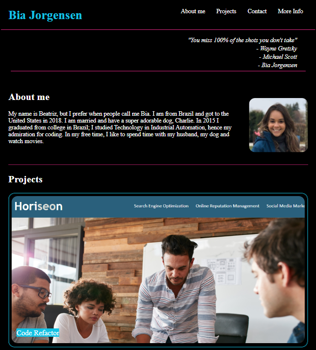
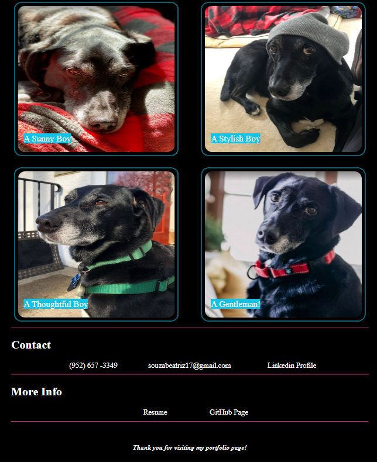

# Beatriz - Portfolio

## Description
Beatriz - Portfolio is a webpage created to showcase Beatriz Jorgensen's projects. This portfolio contains HTML and CSS files created using elements learned in 2 weeks of Full Stack Coding Bootcamp at the University of Minnesota. The webpage is responsive on different screen sizes, adapting to have a good style even in smaller screens, but maitainin all its functions.

## Installation

N/A

## Usage
Click on the elements of the navigation bar to jump to its correspondent section; click on the first project to open its GitHub deployed page; Click on "Linkedin Profile" in the "Contact" section to open Beatriz's Linkedin page; Click on "Resume" in the "More Info" section to open a PDF of Beatriz's resume; Click on "GitHub Page" in the "More Info" section to open Beatriz's page. Please note, besides the first image in the "Projects" Section, the other images are placeholders for when more projects are deployed.

## Credits

N/A

## License

Please refer to the LICENSE in the repo.

## Link to live website

https://biajorgensen.github.io/beatriz-portfolio/

## Website preview

